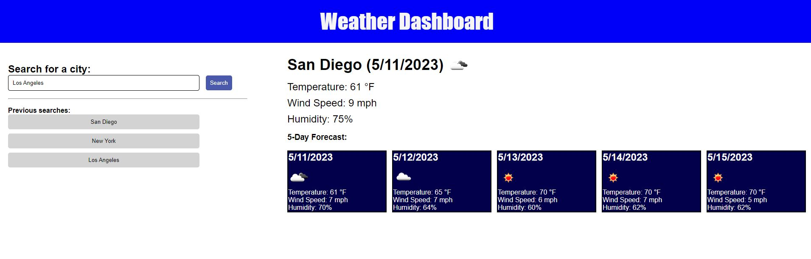

# Challenge 6

## Weather Dashboard

This weather dashboard uses openweathermap.org's API to fetch weather information about a given city that the user enters into a form.  Once the event listener fires, the user is presented with an icon of current weather conditions, today's date, temperature (in Fahrenheit aka Imperial units), and humidity for that city.  The user is also given a 5-day forecast with the same information.  For sake of convenience (and for the sake of the acceptance criteria), searches are saved in local storage and persist even upon page refresh under "Previous searches" in case the user wants to return to information about that city.

## Screenshot

## Links

https://github.com/GSuhir/weather-dashboard

https://gsuhir.github.io/weather-dashboard/
